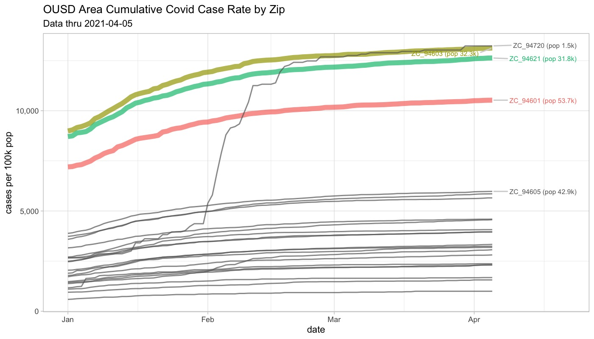
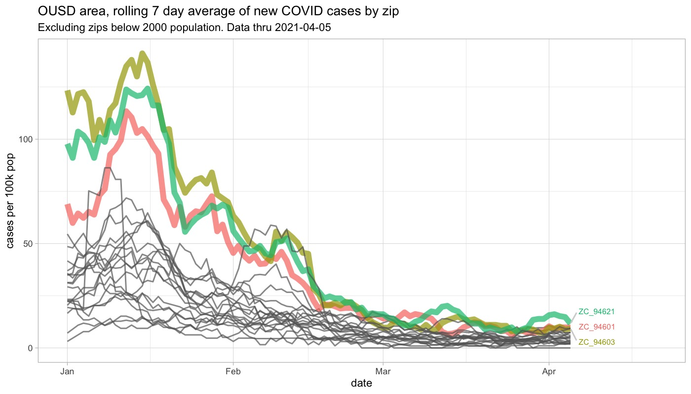

## Oakland USD Covid Prevalance by Zip

In their [recent proposal](https://docs.google.com/document/d/e/2PACX-1vTdsR_PZTP1LqRKzYFaNarV44k86EqjP4k8NIilJI0r6O9rwayvNC0-qlCkWGlTIqg5UlJzys2rY3Y_/pub), the OUSD teachers' union (OEA) stated:

> vaccines are not widely available to all educators, community spread is elevated in three Oakland zip codes (94601, 94621 and 94603) in particular. Asking all staff to return in-person in a hybrid model is not appropriate at this time,

I wanted to better understand the second claim (elevated spread in three zipcodes), so I looked at the available [Alameda County open data](https://data.acgov.org/datasets/5d6bf4760af64db48b6d053e7569a47b_0).

## TLDR

These zips have definitely suffered, with much higher cumulative cases than other zip codes

If you think of "spread" as _new cases_ rather than cumulative cases, though, it looks like recently this has settled down, and these three zips are more similar to the other OUSD-adjacent zip codes

## Quick note on data

Alameda county only publishes a snap shot of case rates. If you want the time series, you have to back it out from the cumulative case data. Alameda Co is bigger than just OUSD, so I did a quick and dirty intersection of zips and district to determine 'OUSD adjacent' zips. Map:

## Now what?

Opportunity and suffering are not evenly or fairly distributed in Oakland, that's for sure. But I think the lack of open schools in the fall would be a huge failure for everyone's kids. I really hope OUSD and OEA recognize the urgency and make appropriate plans for safe in person opening come the fall.
